# Ứng dụng thuê trọ

## Công nghệ
- Flutter
- Firebase

## Các tính năng
- Authentication
  - Đăng nhập bằng số điện thoại (OTP)
  - Đăng kí bằng số điện thoại (OTP)
- Hiển thị phòng trọ xung quanh vị trí người dùng (Google Map API)
- Tìm kiếm phòng trọ theo các tiêu chí
- Đăng phòng trọ với đầy đủ thông tin
- Xem thông tin chủ trọ
  - Xem đánh giá chủ trọ
  - Liên hệ chủ trọ qua số điện thoại & tin nhắn
- Thanh toán tiền cọc
- Thanh toán hóa đơn điện nước (đang phát triển)
- Quản lí hóa đơn thanh toán
- Gửi yêu cầu/ xử lí yêu cầu thuê trọ
- Thao tác với thông tin cá nhân

## Splash Screen

## Tính năng Authentication

  
  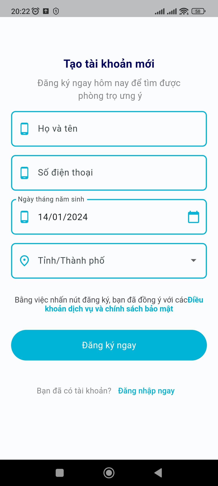
  
  

## Dashboard

  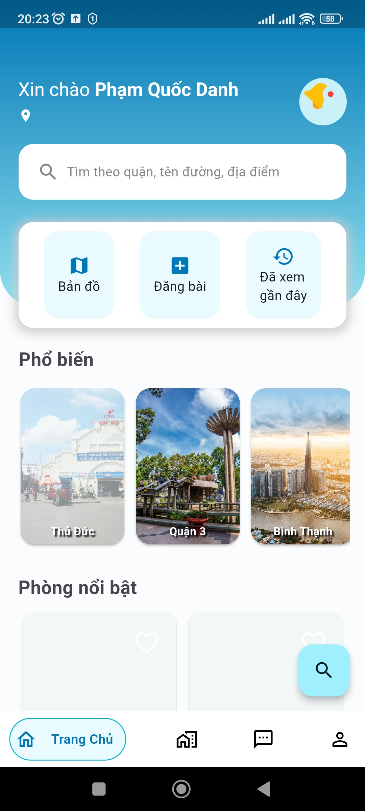
  
  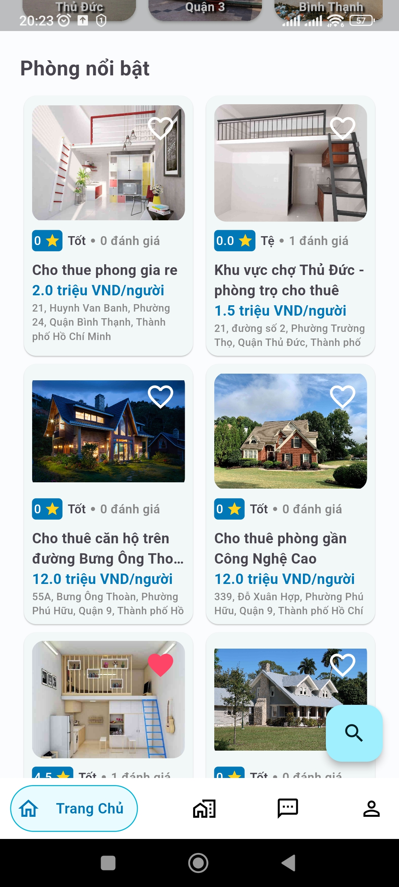
    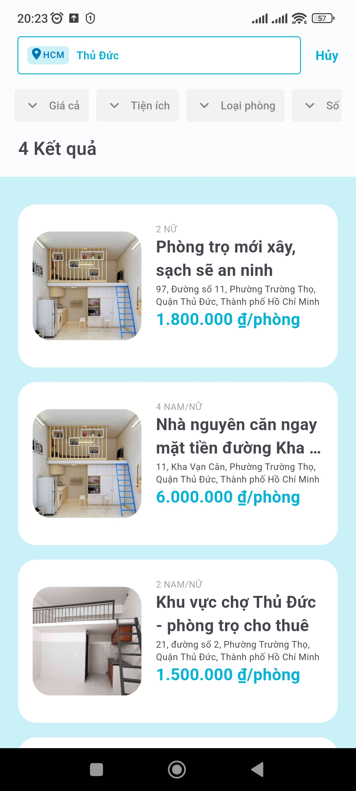

### Map
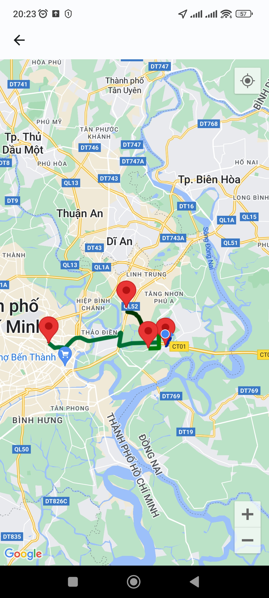

### Đăng phòng
  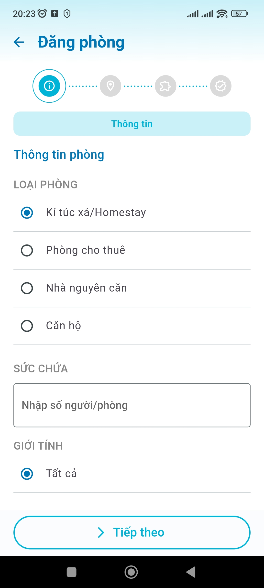

### Đã xem gần đây
  

## Chi tiết phòng
  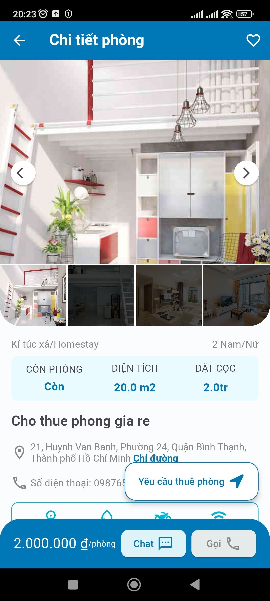

### Quản lí phòng

  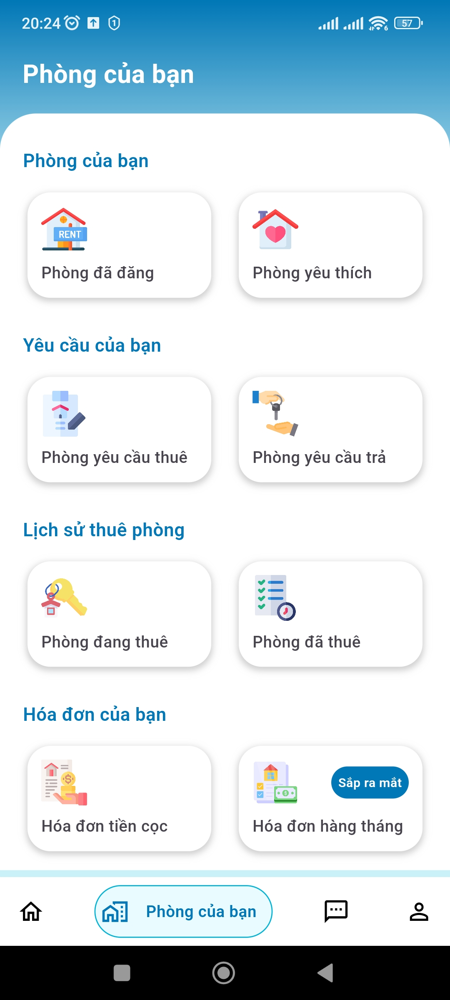
    
    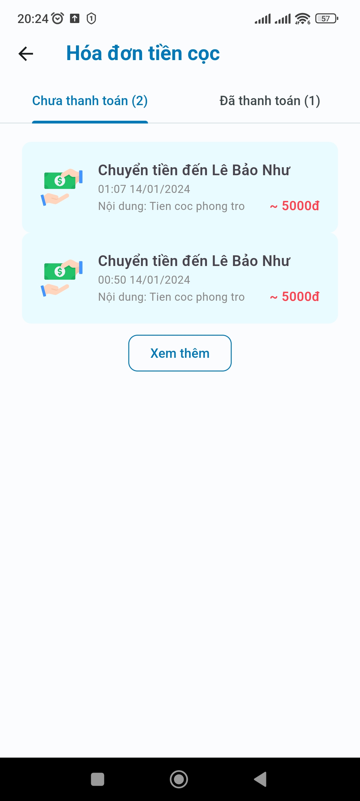
    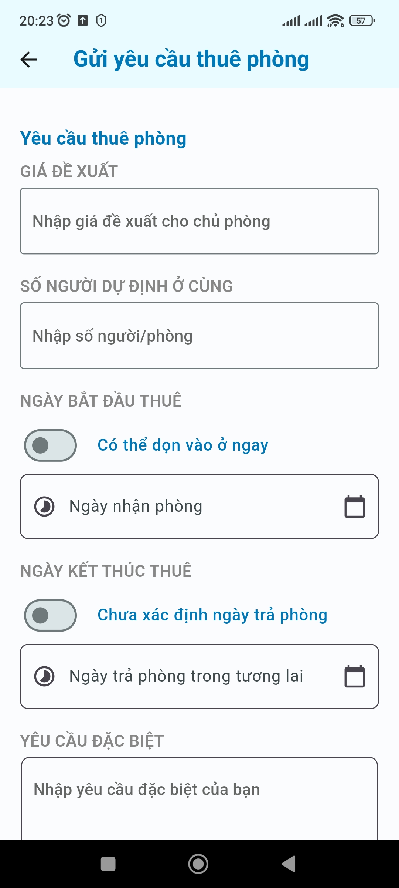
  

  ### Tin nhắn
  

      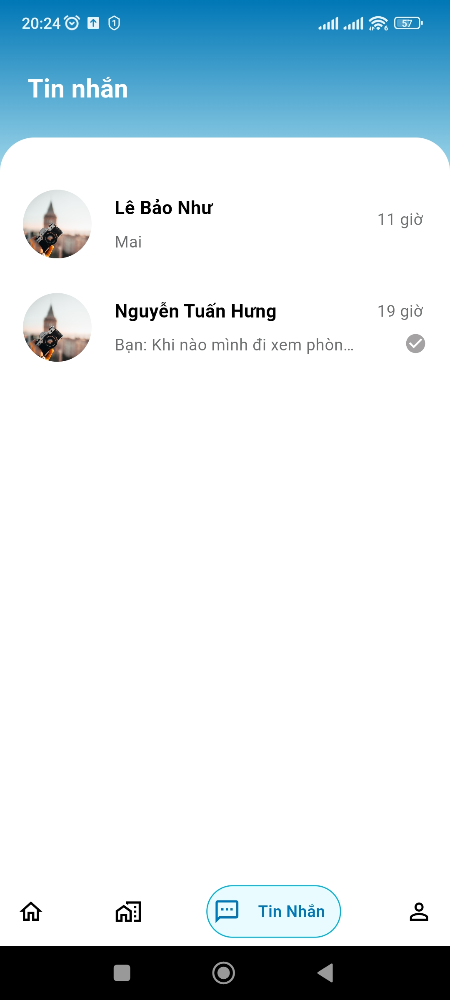
      
  

